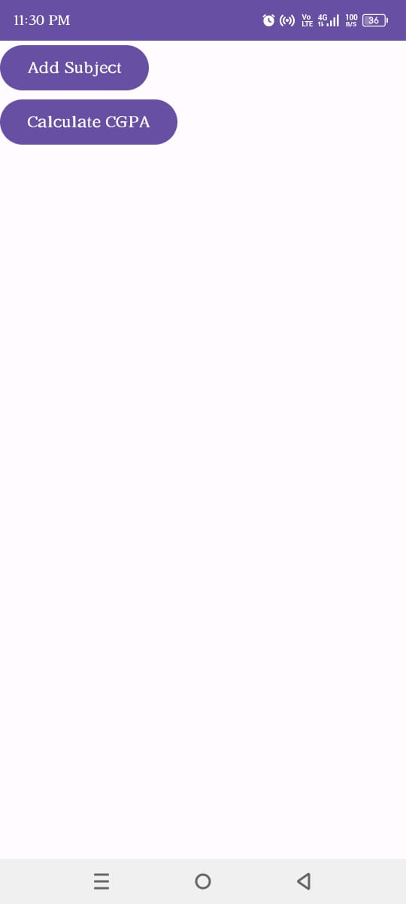
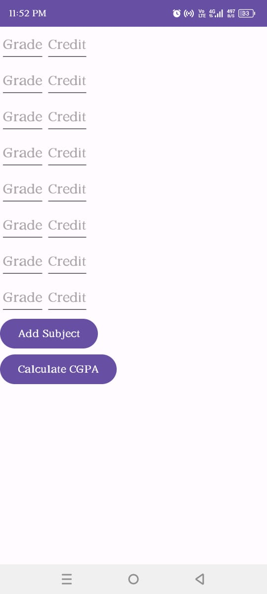
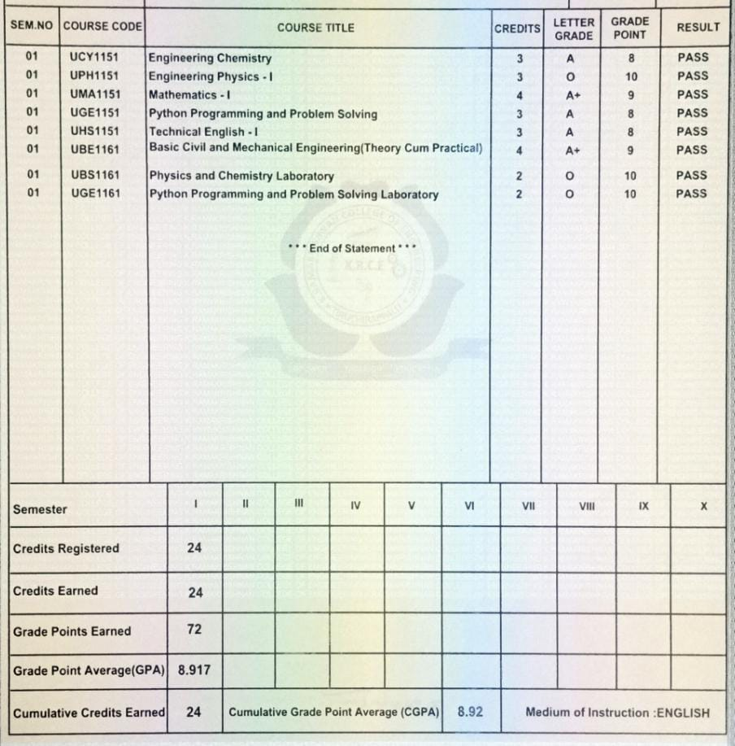

# GPA Calculator

A simple and intuitive GPA calculator built using Android Studio. This application helps students to calculate their GPA based on their grades and credit.

## Features

- Simple structure
- students add subject whatever they need
- only need grade and credit
- show the result in within one seconds


## Deployment

To deploy this project run

- Android Studio installed:
```bash
   Download Android Studio
```

- Open in Android Studio:
```bash
Open the project directory in Android Studio. and add the java file and xml file in the project directory
```
- Run the App: 
```bash
  Click the "Run" button or use the "Run" menu to launch the app on an emulator or connected device.
```

## Sample Output Screenshots with Marksheet











